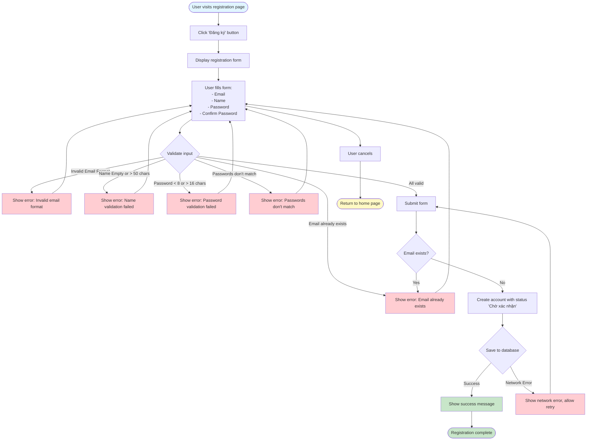

# 2.1.1 User Registration Flow

## Feature: User Registration
**Actor:** Public (Anyone)  
**Dependencies:** None

## Flowchart

## Validation Rules
- **Email:** Valid email format
- **Name:** Not empty, max 50 characters
- **Password:** Not empty, min 8, max 16 characters
- **Confirm Password:** Must match password

## Error Cases
- Email already exists
- Invalid email format
- Name validation failed
- Password validation failed
- Passwords don't match
- Network error during submission

