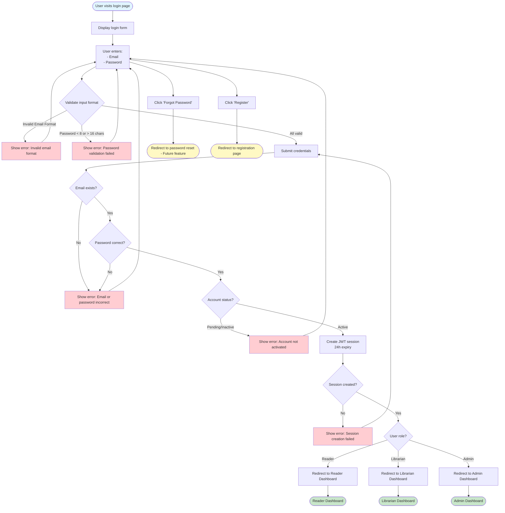

# 2.1.2 User Login Flow

## Feature: User Login
**Actor:** Public (Anyone)  
**Dependencies:** 2.1.1 (User Registration)

## Flowchart

## Validation Rules
- **Email:** Valid email format
- **Password:** Not empty, min 8, max 16 characters

## Error Cases
- Email not found
- Wrong password
- Account inactive/pending
- Session creation fails
- Network error

## Alternative Flows
- Forgot password (future feature)
- Navigate to registration page

