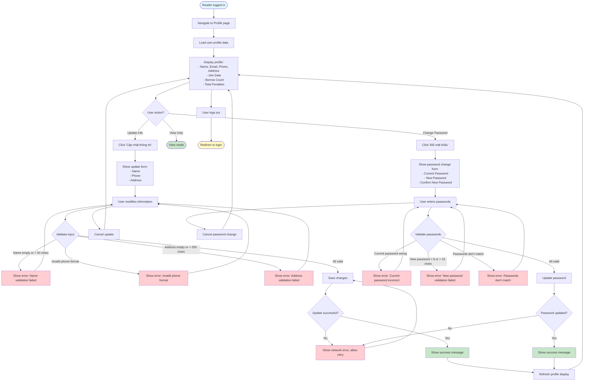

# 2.1.3 User Profile Flow

## Feature: User Profile Management
**Actor:** Reader  
**Dependencies:** 2.1.2 (Login)

## Flowchart

## Validation Rules
- **Name:** Not empty, max 50 characters
- **Phone:** Valid phone format
- **Address:** Not empty, max 255 characters
- **Current Password:** Must match existing password
- **New Password:** Min 8, max 16 characters

## Error Cases
- Name validation failed
- Invalid phone format
- Address validation failed
- Current password incorrect
- New password validation failed
- Passwords don't match
- Network error

