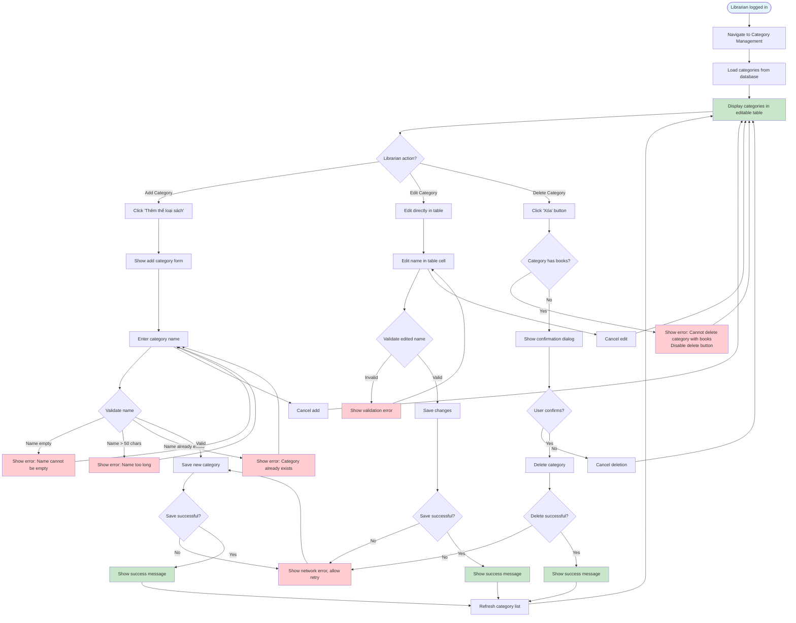

# 2.2.1 Category Management Flow

## Feature: Book Category Management
**Actor:** Librarian  
**Dependencies:** 2.1.2 (Login)

## Flowchart

## Validation Rules
- **Category Name:** Not empty, max 50 characters, unique

## Error Cases
- Category name is empty
- Category name > 50 characters
- Category name already exists
- Category has books (cannot delete)
- Network error

