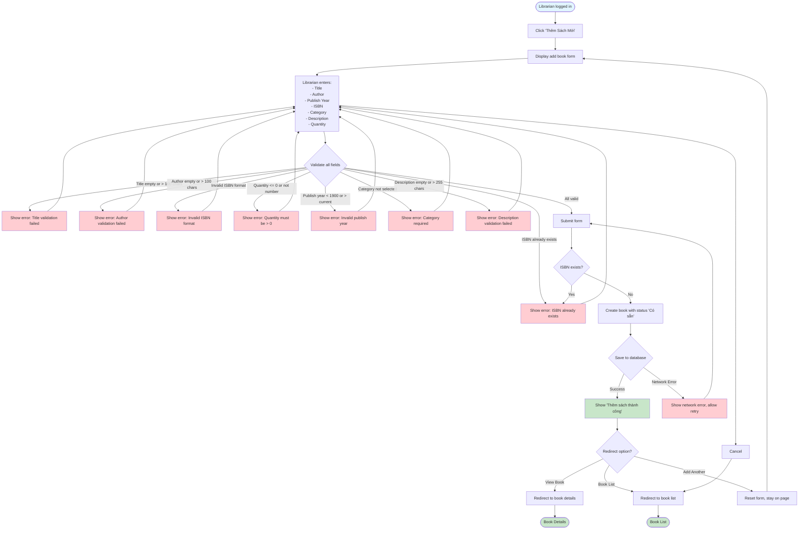

# 2.2.2 Add New Book Flow

## Feature: Add New Book
**Actor:** Librarian  
**Dependencies:** 2.1.2 (Login), 2.2.1 (Category Management)

## Flowchart

## Validation Rules
- **Title:** Not empty, max 100 characters
- **Author:** Not empty, max 100 characters
- **ISBN:** Valid ISBN-10 or ISBN-13 format (if provided)
- **Quantity:** Must be > 0, numeric
- **Publish Year:** Valid year (1900 - current year)
- **Category:** Must be selected
- **Description:** Not empty, max 255 characters

## Error Cases
- Title validation failed
- Author validation failed
- Invalid ISBN format
- ISBN already exists
- Quantity validation failed
- Invalid publish year
- Category not selected
- Description validation failed
- Network error

