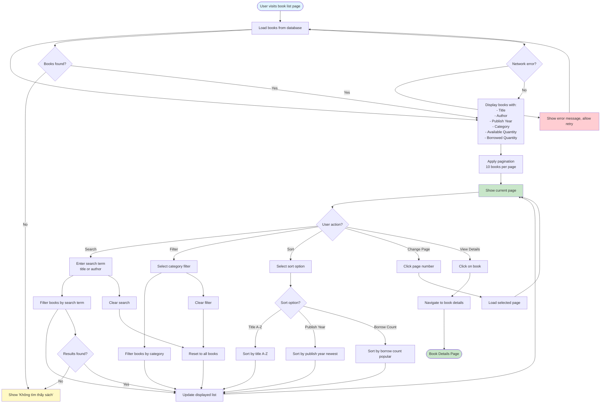

# 2.2.3 View Book List Flow

## Feature: View Book List
**Actor:** All Users (Public, no login required)  
**Dependencies:** None

## Flowchart

## Features
- **Search:** By book title or author
- **Filter:** By category
- **Sort:** Title (A-Z), Publish Year (Newest), Borrow Count (Most Popular)
- **Pagination:** 10 books per page

## Error Cases
- No books found
- Network error
- Invalid page number

