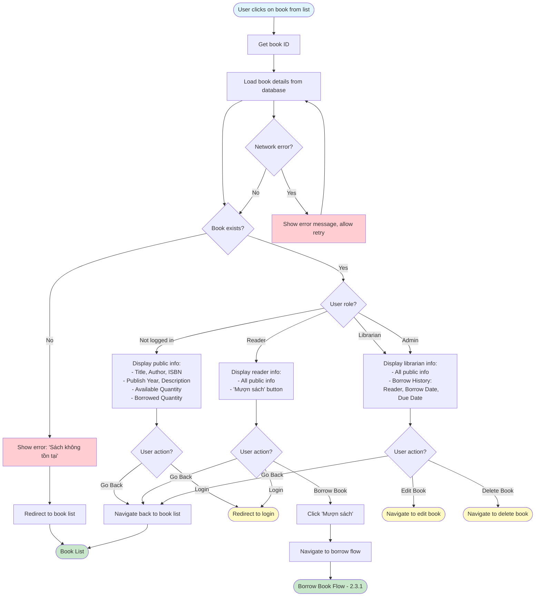

# 2.2.4 View Book Details Flow

## Feature: View Book Details
**Actor:** All Users (Public, no login required)  
**Dependencies:** 2.2.3 (View Book List)

## Flowchart

## Display Information
- **Public:** Title, Author, ISBN, Publish Year, Description, Available Quantity, Borrowed Quantity
- **Librarian/Admin:** All public info + Borrow History (Reader, Borrow Date, Due Date)
- **Reader:** All public info + "Mượn sách" button

## Error Cases
- Book not found
- Network error

## Alternative Flows
- Navigate back to book list
- Navigate to borrow flow (for readers)
- Navigate to edit/delete (for librarians)

