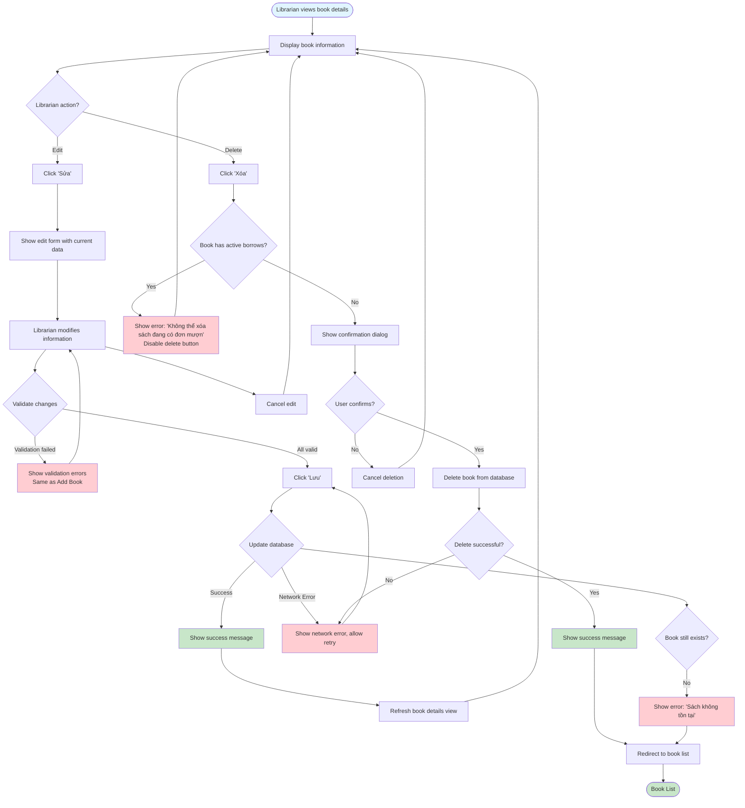

# 2.2.5 Edit & Delete Book Flow

## Feature: Edit & Delete Book
**Actor:** Librarian  
**Dependencies:** 2.1.2 (Login), 2.2.4 (View Book Details)

## Flowchart

## Validation Rules
- Same as Add Book (2.2.2)
- Book must not have active borrows to be deleted

## Error Cases
- Book has active borrows (cannot delete)
- Validation errors (same as Add Book)
- Book not found
- Network error

