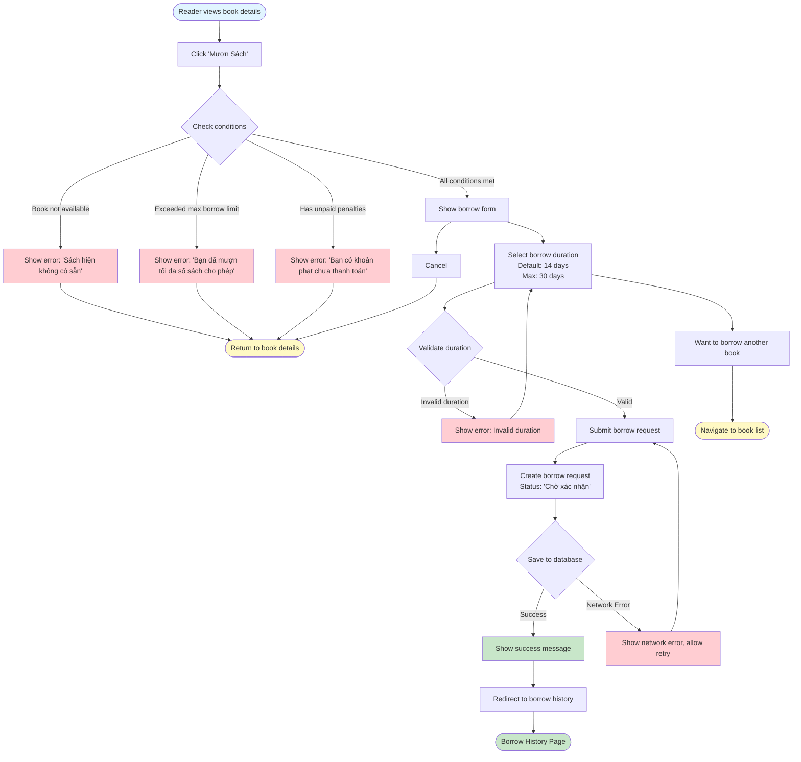

# 2.3.1 Borrow Book - Reader Flow

## Feature: Borrow Book - Reader
**Actor:** Reader  
**Dependencies:** 2.1.2 (Login), 2.2.4 (View Book Details)

## Flowchart

## Conditions
- Book must be available (quantity > 0)
- Reader must not exceed max borrow limit (default 5)
- Reader must have no unpaid penalties

## Validation Rules
- Borrow duration: 1-30 days (default 14)

## Error Cases
- Book not available
- Reader exceeds max borrow limit
- Reader has unpaid penalties
- Invalid borrow duration
- Network error

