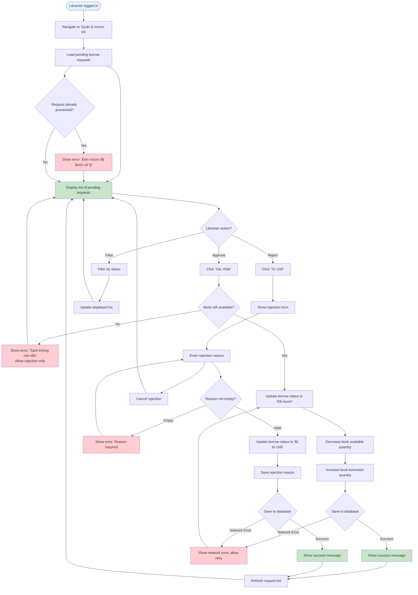

# 2.3.2 Borrow Book - Librarian Flow

## Feature: Borrow Book Approval - Librarian
**Actor:** Librarian  
**Dependencies:** 2.1.2 (Login), 2.3.1 (Borrow Book - Reader)

## Flowchart

## Validation Rules
- Rejection reason: Not empty, required when rejecting

## Error Cases
- Rejection reason is empty
- Book no longer available (allow rejection only)
- Network error
- Request already processed

