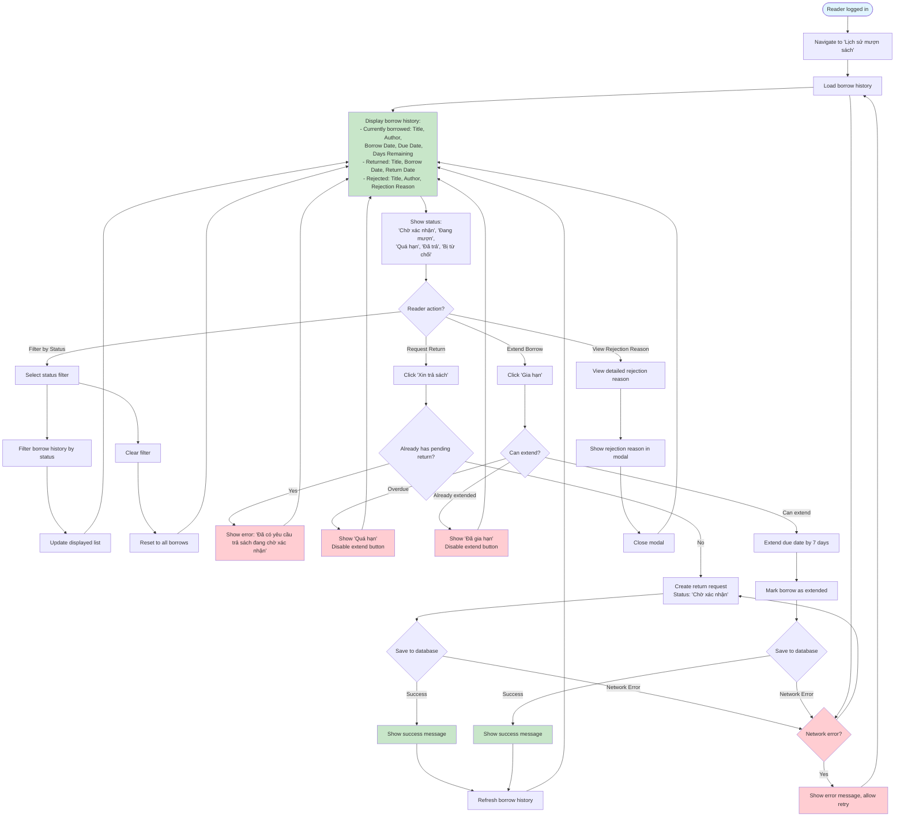

# 2.3.3 View Borrow History Flow

## Feature: View Borrow History
**Actor:** Reader  
**Dependencies:** 2.1.2 (Login), 2.3.1 (Borrow Book)

## Flowchart

## Validation Rules
- Only one pending return request per borrow
- Extend only if: not overdue, not already extended (max 1 time)
- Extend duration: +7 days

## Error Cases
- Book already has pending return request
- Book is overdue (cannot extend)
- Book already extended (cannot extend again)
- Network error

