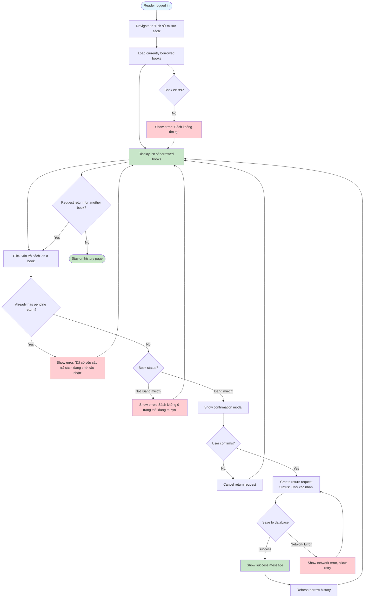

# 2.4.1 Return Request Flow

## Feature: Return Request
**Actor:** Reader  
**Dependencies:** 2.1.2 (Login), 2.3.1 (Borrow Book)

## Flowchart

## Validation Rules
- Only one pending return request per borrow
- Book must be in "Đang mượn" (Approved) status

## Error Cases
- Book already has pending return request
- Book not found
- Book not in correct status
- Network error

## Note
- Reader needs to bring physical book to library for librarian confirmation

