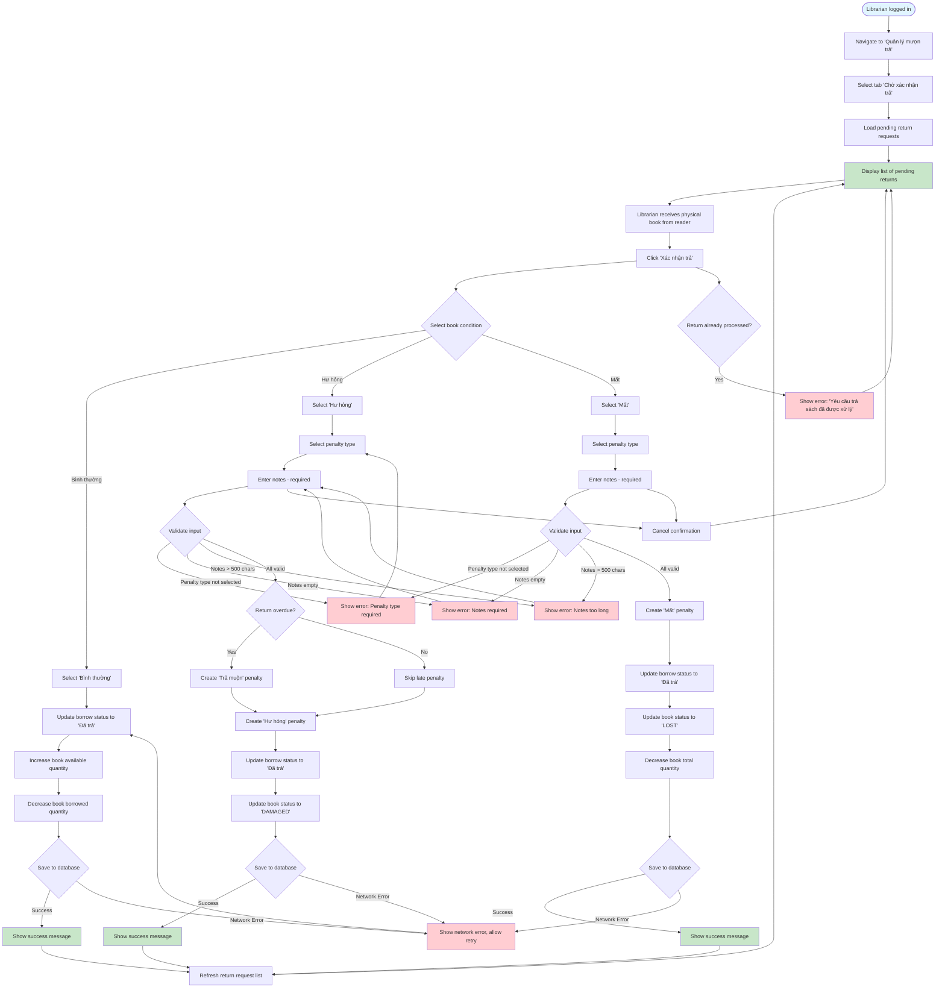

# 2.4.2 Confirm Return Flow

## Feature: Confirm Return
**Actor:** Librarian  
**Dependencies:** 2.1.2 (Login), 2.4.1 (Return Request), 2.5.1 (Penalty Type Management)

## Flowchart

## Validation Rules
- **Book condition:** Required, must be one of: Normal, Damaged, Lost
- **Penalty type:** Required when condition is Damaged or Lost
- **Notes:** Required when condition is Damaged or Lost, max 500 characters

## Error Cases
- Penalty type not selected (for damaged/lost)
- Notes is empty (for damaged/lost)
- Notes > 500 characters
- Book condition not selected
- Network error
- Return request already processed

## Special Cases
- **Damaged + Overdue:** Creates both "Hư hỏng" and "Trả muộn" penalties
- **Lost:** Decreases total book quantity

