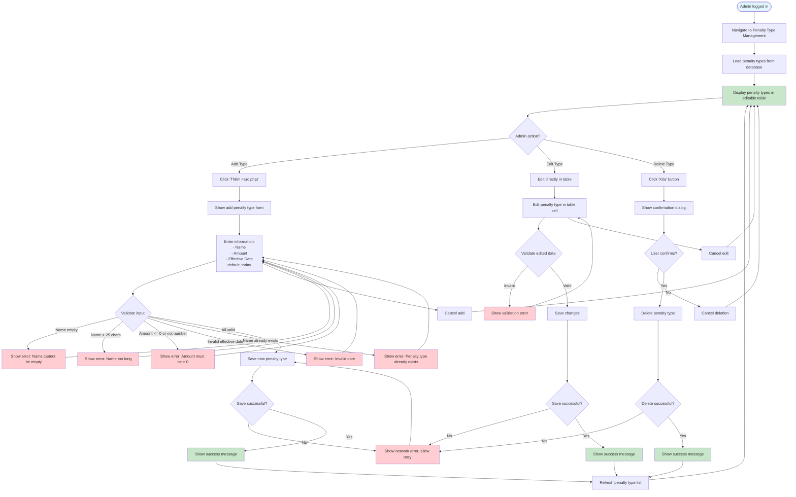

# 2.5.1 Penalty Type Management Flow

## Feature: Penalty Type Management
**Actor:** Admin  
**Dependencies:** 2.1.2 (Login)

## Flowchart

## Validation Rules
- **Name:** Not empty, max 25 characters
- **Amount:** Must be > 0, numeric
- **Effective Date:** Valid date (default: current date)

## Error Cases
- Penalty type name is empty
- Penalty type name > 25 characters
- Amount <= 0 or not a number
- Invalid effective date
- Penalty type already exists
- Network error

