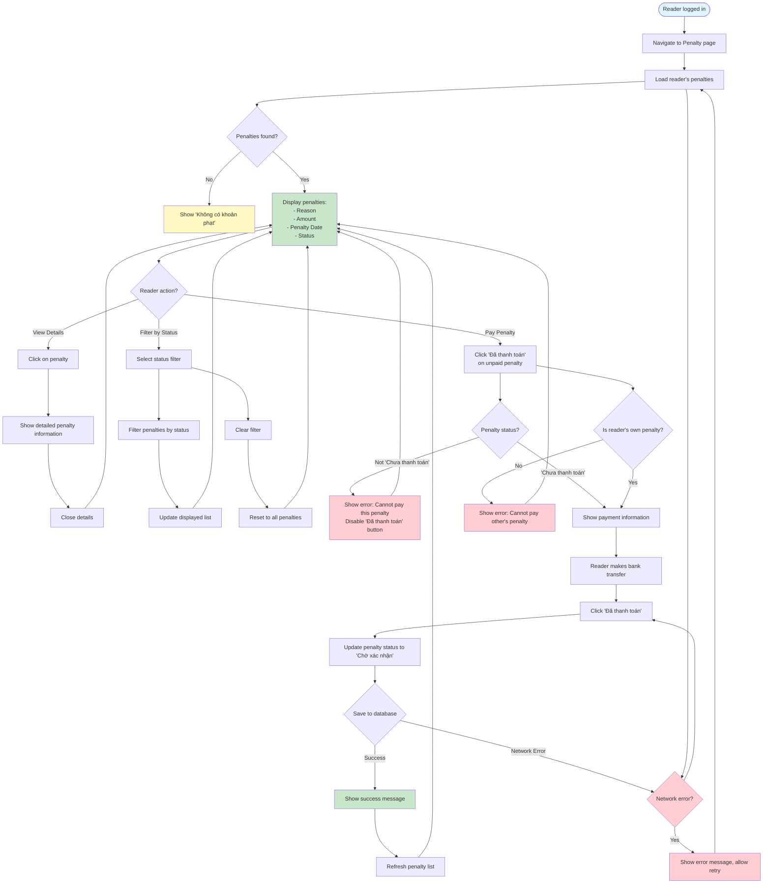

# 2.5.2 View & Pay Penalty - Reader Flow

## Feature: View & Pay Penalty - Reader
**Actor:** Reader  
**Dependencies:** 2.1.2 (Login), 2.4.2 (Confirm Return), 2.5.1 (Penalty Type Management)

## Flowchart

## Validation Rules
- Penalty must be in "Chưa thanh toán" status to be paid
- Only reader's own penalties can be paid

## Error Cases
- No penalties found
- Penalty already paid
- Not reader's own penalty
- Network error

## Note
- Reader makes bank transfer payment, then marks as paid
- Status changes to "Chờ xác nhận" waiting for librarian confirmation

