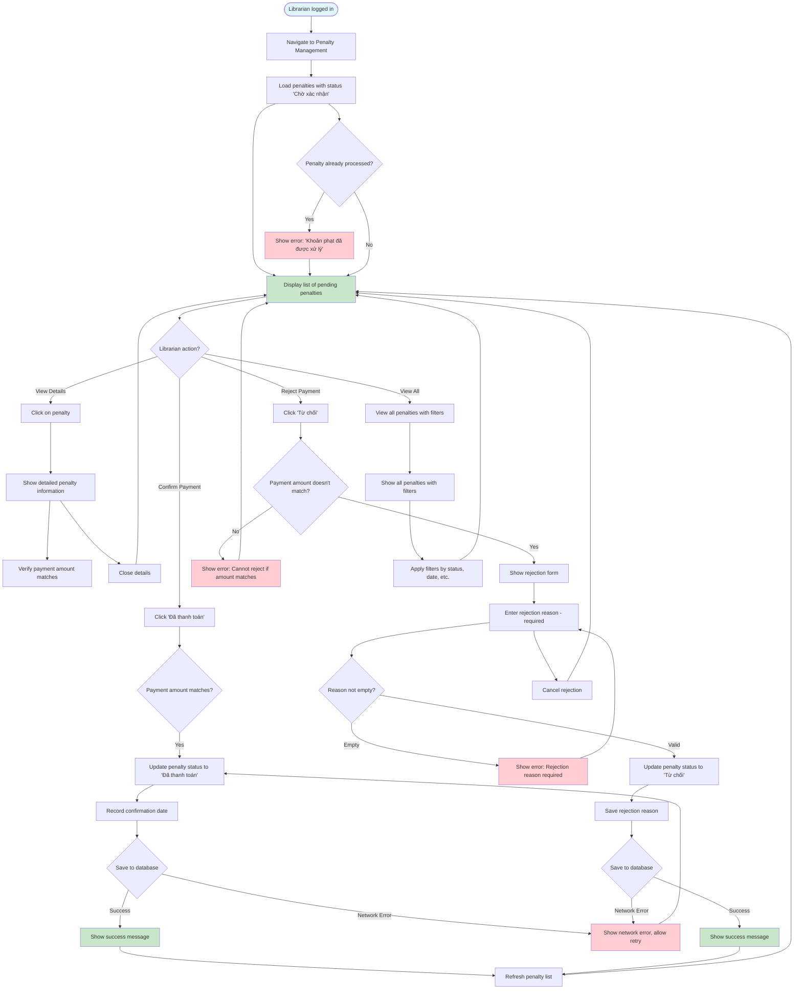

# 2.5.3 View & Pay Penalty - Librarian Flow

## Feature: View & Pay Penalty Confirmation - Librarian
**Actor:** Librarian  
**Dependencies:** 2.1.2 (Login), 2.5.2 (View & Pay Penalty - Reader)

## Flowchart

## Validation Rules
- Rejection reason: Required when rejecting, not empty

## Error Cases
- Rejection reason is empty
- Penalty already processed
- Network error

## Process
- Librarian verifies payment amount
- If matches: Confirm payment
- If doesn't match: Reject with reason

