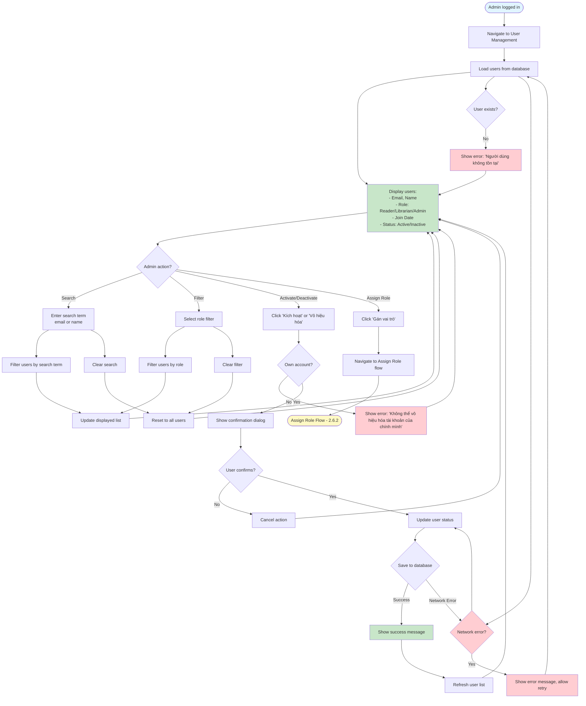

# 2.6.1 User List Flow

## Feature: User List Management
**Actor:** Admin  
**Dependencies:** 2.1.2 (Login)

## Flowchart

## Features
- **Search:** By email or name
- **Filter:** By role (Reader, Librarian, Admin)
- **Activate/Deactivate:** User accounts
- **Assign Role:** Navigate to role assignment flow

## Validation Rules
- Search: Optional, matches email or name
- Role filter: Optional, must be valid role
- Cannot deactivate own account

## Error Cases
- User not found
- Cannot deactivate own account
- Network error

