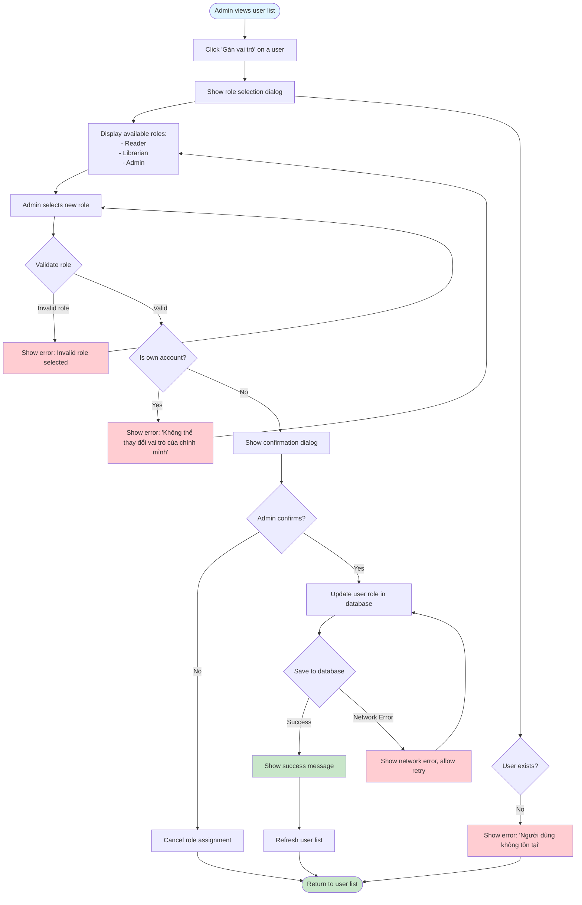

# 2.6.2 Assign Role Flow

## Feature: Assign User Role
**Actor:** Admin  
**Dependencies:** 2.1.2 (Login), 2.6.1 (User List)

## Flowchart

## Validation Rules
- Role must be one of: Reader, Librarian, Admin
- Cannot change own role

## Error Cases
- User not found
- Invalid role selected
- Cannot change own role
- Network error

## Role Permissions
- **Reader:** Can borrow books, view personal history
- **Librarian:** Can manage books, confirm borrow/return, track penalties
- **Admin:** Full access, manage accounts, reports, settings

