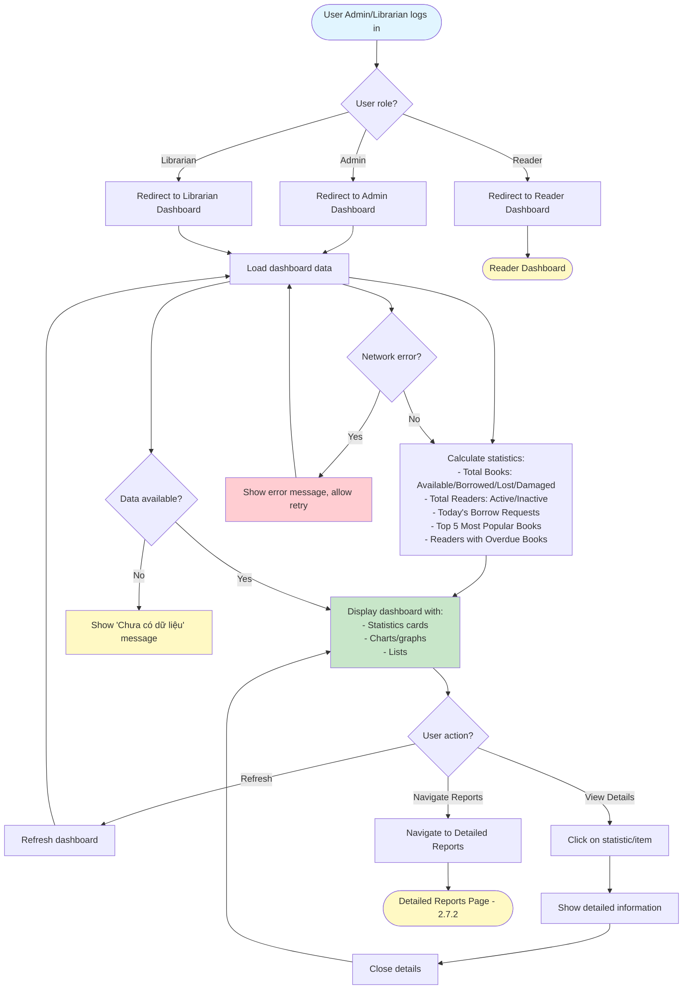

# 2.7.1 Dashboard Overview Flow

## Feature: Dashboard Overview
**Actor:** Admin, Librarian  
**Dependencies:** 2.1.2 (Login), 2.2.2 (Add Book), 2.3.1 (Borrow Book), 2.4.2 (Confirm Return)

## Flowchart

## Display Information
- **Total Books:** Available / Borrowed / Lost / Damaged
- **Total Readers:** Active / Inactive
- **Today's Borrow Requests**
- **Top 5 Most Popular Books**
- **List of Readers with Overdue Books**

## Error Cases
- No data available
- Network error

## Alternative Flows
- Refresh dashboard
- View detailed information
- Navigate to detailed reports

