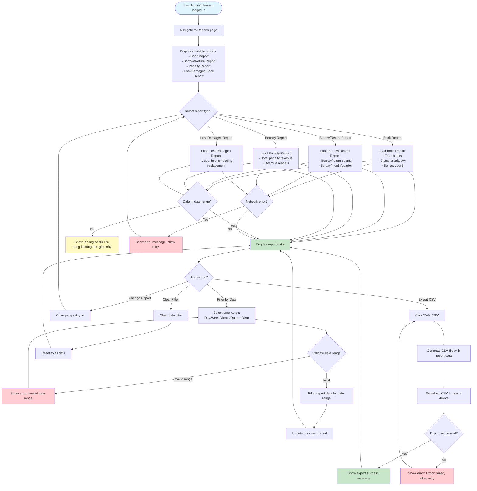

# 2.7.2 Detailed Reports Flow

## Feature: Detailed Reports
**Actor:** Admin, Librarian  
**Dependencies:** 2.1.2 (Login), 2.7.1 (Dashboard Overview)

## Flowchart

## Available Reports
1. **Book Report:** Total books, status, borrow count
2. **Borrow/Return Report:** Borrow/return counts by day/month/quarter
3. **Penalty Report:** Total penalty revenue, overdue readers
4. **Lost/Damaged Book Report:** List of books needing replacement

## Features
- **Filter by Date Range:** Day, Week, Month, Quarter, Year
- **Export to CSV:** Download report data

## Validation Rules
- Date range: Valid date range (start <= end)
- Date range options: Day, Week, Month, Quarter, Year

## Error Cases
- No data in date range
- Invalid date range
- Export fails
- Network error

